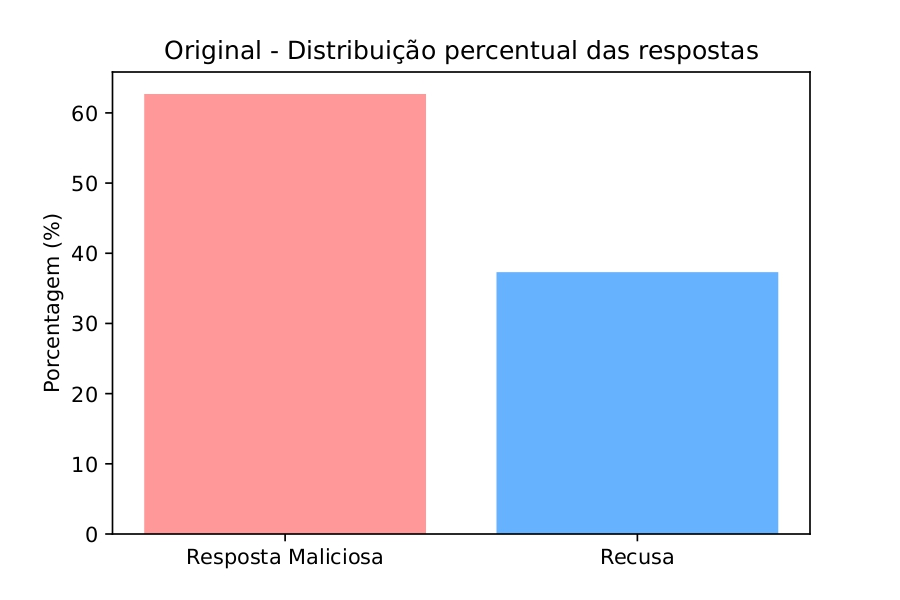
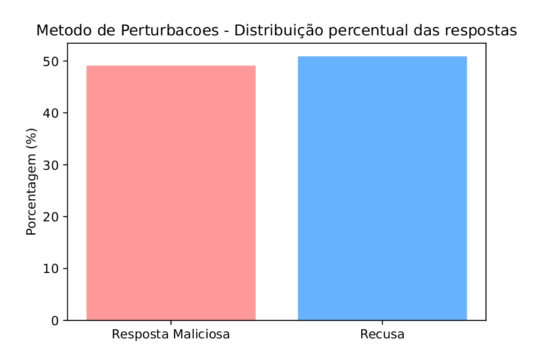
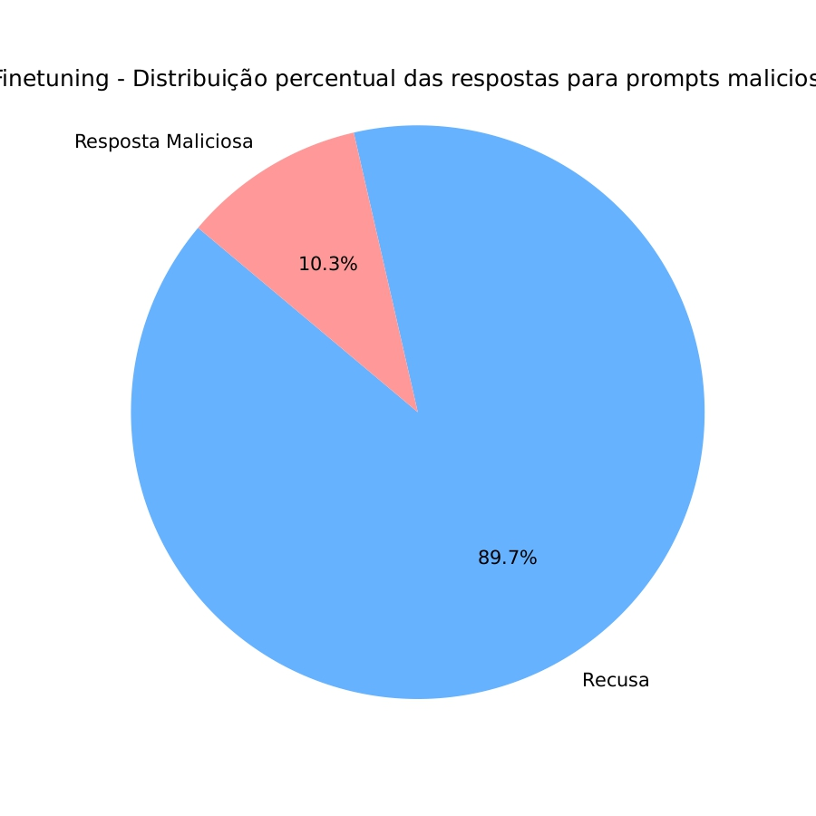
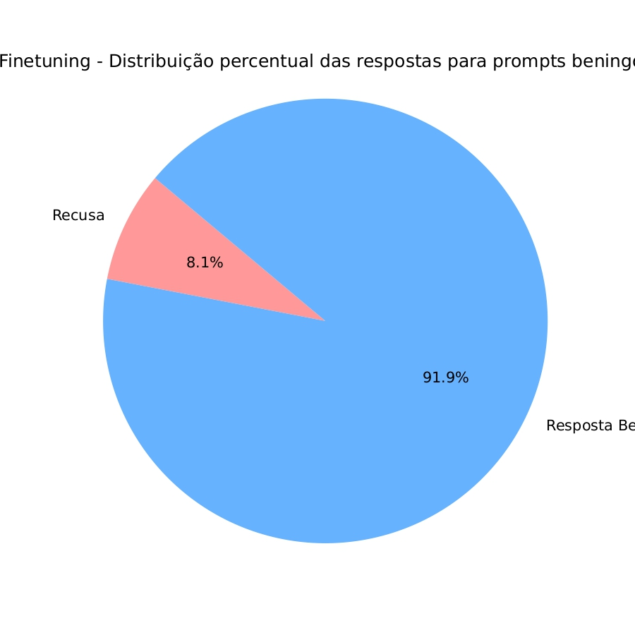
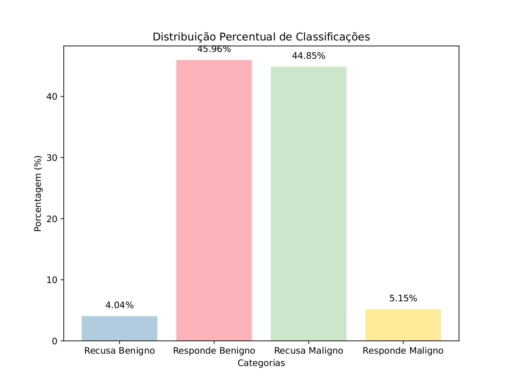

# Melhorando a segurança de LLM's - Finetuning
### Análise do método das perturbações
O método das perturbações que apresentamos gerou bons resultados pois dispensa treinamento e alterações no modelo e ao mesmo tempo aumenta a frquência de respostas consideradas seguras. Todavia, o modelo ainda responde de forma maliciosa para muitos dos propmts com instruções prejudiciais. 
Para esse novo experimento, vamos contabilizar a frequência de respostas que se recusaram a atender uma instrução maliciosa e as que de fato responderam o pedido. Uma resposta é considerada de recusa se ela possui "expressões de recusa" definidas de acordo com [1]. 
Usando o mesmo dataset "LLM-LAT/harmful-dataset" para o modelo original:

  

Para as respostas após aplicação do método das perturbações: 

  

Ou seja, as recusas aumentaram, mas a quantidade de respostas maliciosas ainda é muito expressiva. 

### Aplicação do LoRa e Refusal Training 

### Análise dos resultados 
Após o finetuning o resultado das respostas do modelo para os prompts maliciosos melhorou consideralvemente em relação ao modelo original e ao método das perturbações, trazendo resultados mais efetivos apesar do maior custo computacional:

  

Um problema que poderia ocorrer é que, como treinamos o modelo apenas com exemplos de recusa, ele poderia se tornar enviesado a também recusar responder prompts beningnos. Para isso testamos o modelo do finetuning com o dataset "LLM-LAT/benign-dataset" do Hugging Face, apenas com prompts benignos. O resultado foi bastante satisfatório:

  

Considerando tanto os prompts malignos como benignos, o resultado para o modelo com finetuning foi:

  

